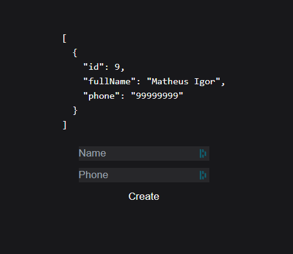

<h1 align="center">Full-Stack with Next</h1>
<p align="center">
  Full stack application in Next.js for learning.
  The application uses the edge computing paradigm, employing server actions with Next and serverless computing with Neon.
</p>

<div align="center">
  
  
  [](https://shields.io/)
</div>

## Technologies
+ [Next.JS](https://nextjs.org/)
+ [Vercel](https://vercel.com/docs) => deploy
+ [Neon](https://neon.tech/docs/introduction) => serverless computing
+ [Drizzle](https://orm.drizzle.team/) => ORM for edge computing

## How to use
Clone the repository.
#### Install the dependencies.
```
  npm i
```
#### Run the project.
```
  npm run dev
```

## Project

